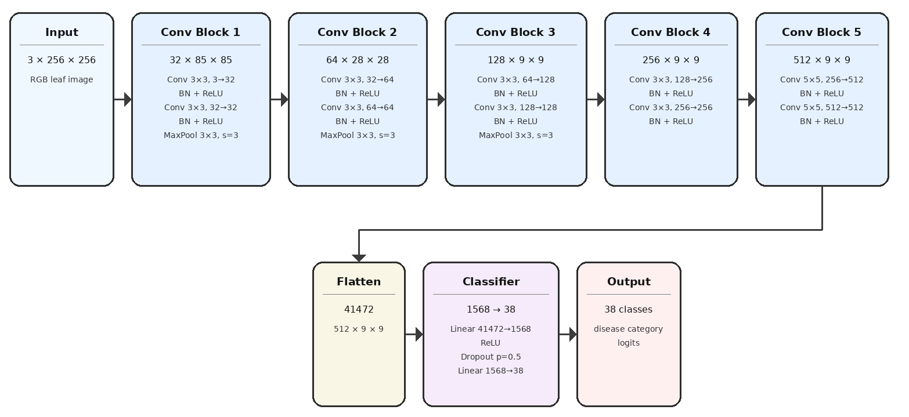
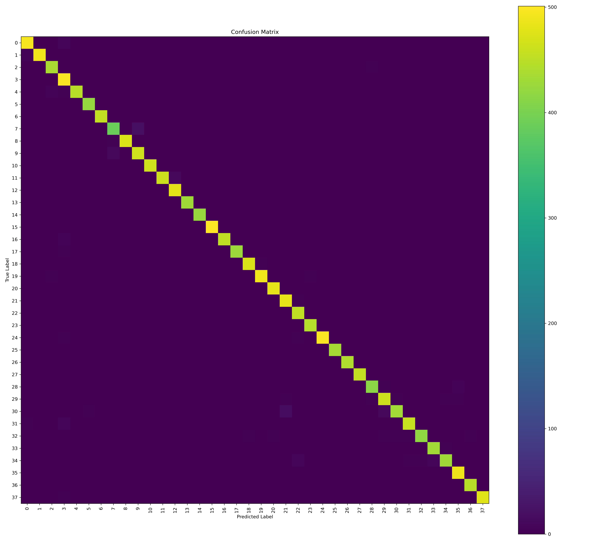
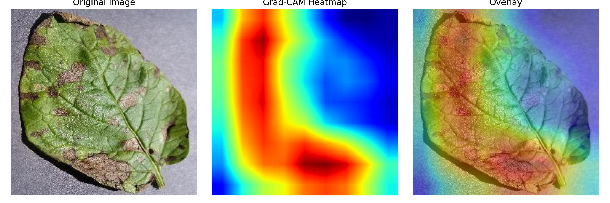

# Plant Diseases Detection - 38 Classes

> 基于 PyTorch 的农作物叶片病害识别项目，依托 Kaggle PlantVillage 扩展数据集构建 38 类作物病害分类模型，并结合混淆矩阵与 Grad-CAM 对模型结果进行分析与可解释性展示。

本项目面向智慧农业中人工识别作物病害效率低、主观性强、基层农技资源不足等问题，使用深度学习方法对作物叶片图像进行自动分类识别。项目基于公开植物病害图像数据集完成数据读取、图像预处理、CNN 模型构建、GPU 训练、验证评估、测试集预测、混淆矩阵分析与 Grad-CAM 可解释性可视化。

---
## 模型结构图

<p align="center">
  
</p>

---

## 项目亮点

* **38 类作物病害识别**：覆盖苹果、玉米、葡萄、番茄、马铃薯、辣椒、草莓等多种作物的健康与病害类别。
* **自定义 CNN 模型**：基于 `Conv2d + BatchNorm2d + ReLU + MaxPool2d + Dropout` 搭建多层卷积神经网络。
* **GPU 训练支持**：自动检测 CUDA，支持在 NVIDIA GPU 上加速训练。
* **完整训练流程**：包含数据加载、类别映射保存、训练/验证循环、损失与准确率统计、模型保存。
* **模型评估分析**：输出分类报告、混淆矩阵、易混淆类别统计，便于分析模型短板。
* **Grad-CAM 可解释性分析**：通过热力图展示模型在叶片图像中的关注区域，增强结果可解释性。
* **适合科研与简历展示**：项目流程完整，能够体现图像分类、深度学习建模、实验分析和可解释性分析能力。

---

## 数据集说明

本项目使用 Kaggle 上的植物病害图像数据集：

* 数据集名称：`New Plant Diseases Dataset`
* 任务类型：多分类图像识别
* 类别数量：38 类
* 训练集：约 70,295 张图像
* 验证集：约 17,572 张图像
* 测试集：约 33 张图像

数据目录建议组织为：

```text
data/
└── New Plant Diseases Dataset(Augmented)/
    └── New Plant Diseases Dataset(Augmented)/
        ├── train/
        │   ├── Apple___Apple_scab/
        │   ├── Apple___Black_rot/
        │   └── ...
        └── valid/
            ├── Apple___Apple_scab/
            ├── Apple___Black_rot/
            └── ...
└── test/
    └── test/
        ├── AppleCedarRust1.JPG
        ├── PotatoEarlyBlight1.JPG
        └── ...
```

> 注意：数据集体积较大，不建议直接上传到 GitHub。请自行下载数据集，并按照上述目录结构放置。

---

## 模型结构

项目中的核心模型为 `PlainCNN`，位于：

```text
src/model.py
```

模型整体结构如下：

```text
输入图像：3 × 256 × 256
    |
    ├── Conv Block 1：3 -> 32
    ├── Conv Block 2：32 -> 64
    ├── Conv Block 3：64 -> 128
    ├── Conv Block 4：128 -> 256
    ├── Conv Block 5：256 -> 512
    |
    ├── Flatten
    ├── Linear + ReLU
    ├── Dropout
    └── Linear 输出 38 类
```

主要设计：

* 使用多层卷积提取叶片纹理、病斑边缘、颜色变化和病害形态特征；
* 使用 BatchNorm 加速训练并提升稳定性；
* 使用 ReLU 引入非线性表达能力；
* 使用 MaxPool 降低特征图尺寸并扩大感受野；
* 使用 Dropout 缓解过拟合；
* 最终通过全连接层输出 38 个类别的分类结果。

---

## 实验结果

在验证集上的整体表现：

| 指标                |     数值 |
| ----------------- | -----: |
| Accuracy          | 98.59% |
| Macro Precision   | 98.62% |
| Macro Recall      | 98.59% |
| Macro F1-score    | 98.59% |
| Weighted F1-score | 98.59% |

部分高表现类别：

| 类别                                         | F1-score |
| ------------------------------------------ | -------: |
| Corn_(maize)___healthy                     |   1.0000 |
| Grape___healthy                            |   0.9988 |
| Strawberry___healthy                       |   0.9989 |
| Squash___Powdery_mildew                    |   0.9988 |
| Grape___Leaf_blight_(Isariopsis_Leaf_Spot) |   0.9977 |

模型仍存在一定易混淆类别，例如：

| 真实类别                                       | 易误判为                                       | 次数 |
| ------------------------------------------ | ------------------------------------------ | -: |
| Corn Cercospora leaf spot / Gray leaf spot | Corn Northern Leaf Blight                  | 21 |
| Tomato Late blight                         | Potato Late blight                         | 16 |
| Corn Northern Leaf Blight                  | Corn Cercospora leaf spot / Gray leaf spot | 11 |
| Tomato Late blight                         | Tomato Early blight                        | 11 |
| Grape Black rot                            | Grape Esca Black Measles                   | 10 |

---

## 可视化结果

### 混淆矩阵

项目会生成混淆矩阵图片，用于分析不同类别之间的误判关系：

<p align="center">
  
</p>


### Grad-CAM 热力图

项目支持使用 Grad-CAM 生成模型关注区域热力图：

<p align="center">
  
</p>

Grad-CAM 可以帮助观察模型是否真正关注叶片病斑区域，而不是背景、边缘或无关噪声。

---

## 项目结构

```text
plant-diseases-detection-38-classes/
├── README.md
├── .gitignore
└── src/
    ├── model.py                         # 自定义 CNN 模型
    ├── train_gpu.py                     # 基础 GPU 训练脚本
    ├── train_gpu2.py                    # 改进版训练脚本，含进度条、最佳模型保存等
    ├── test.py                          # 测试集批量预测脚本
    ├── confusion_matrix_analysis.py     # 混淆矩阵与分类报告分析脚本
    ├── grad_cam.py                      # Grad-CAM 可解释性分析脚本
    ├── outputs/
    │   ├── class_to_idx.json            # 类别到编号的映射
    │   ├── classification_report.txt    # 分类报告
    │   ├── confusion_matrix.csv         # 混淆矩阵数据
    │   ├── confusion_matrix.png         # 混淆矩阵图片
    │   ├── grad_cam_result.jpg          # Grad-CAM 可视化结果
    │   ├── label_index_mapping.txt      # 类别编号映射
    │   ├── test_predictions.json        # 测试集预测结果
    │   └── top_confusions.csv           # 易混淆类别统计
    └── other/
        ├── plant-disease-classification-resnet-99-2.ipynb
        └── plant-disease-detection-using-cnn-with-96-84.ipynb
```

---

## 环境要求

建议环境：

* Python 3.9+
* PyTorch
* TorchVision
* CUDA，可选，用于 GPU 加速训练
* NumPy
* Pandas
* Matplotlib
* scikit-learn
* Pillow
* tqdm
* colorama
* TensorBoard

安装依赖示例：

```bash
pip install torch torchvision torchaudio
pip install numpy pandas matplotlib scikit-learn pillow tqdm colorama tensorboard
```

如果使用 Conda：

```bash
conda create -n plant-disease python=3.9
conda activate plant-disease
pip install torch torchvision torchaudio
pip install numpy pandas matplotlib scikit-learn pillow tqdm colorama tensorboard
```

---

## 快速开始

### 1. 克隆仓库

```bash
git clone https://github.com/JasperChenJH/plant-diseases-detection-38-classes.git
cd plant-diseases-detection-38-classes
```

### 2. 准备数据集

下载 Kaggle 植物病害数据集后，将数据放到项目同级或指定位置，并确保训练脚本中的路径与实际路径一致。

当前脚本默认数据路径为：

```python
ROOT_DIR = "../data/New Plant Diseases Dataset(Augmented)/New Plant Diseases Dataset(Augmented)"
TEST_DIR = "../data/test/test"
```

如果你的数据集路径不同，请修改以下文件中的路径配置：

* `src/train_gpu.py`
* `src/train_gpu2.py`
* `src/test.py`
* `src/confusion_matrix_analysis.py`
* `src/grad_cam.py`

### 3. 训练模型

运行基础训练脚本：

```bash
python src/train_gpu.py
```

或运行改进版训练脚本：

```bash
python src/train_gpu2.py
```

训练过程中会输出：

* 当前设备：CPU / CUDA；
* 训练集类别数；
* 验证集类别数；
* 每个类别的图像数量；
* 每轮训练损失；
* 每轮验证损失；
* 每轮验证准确率。

训练结果会保存到：

```text
src/outputs/
```

### 4. 查看 TensorBoard 曲线

训练脚本会将日志写入：

```text
src/logs/
```

查看训练过程：

```bash
tensorboard --logdir=src/logs
```

浏览器打开：

```text
http://localhost:6006
```

### 5. 测试集预测

确认已经有模型权重文件，例如：

```text
model_8.pth
```

然后运行：

```bash
python src/test.py
```

预测结果会保存到：

```text
src/outputs/test_predictions.json
```

### 6. 混淆矩阵与分类报告

运行：

```bash
python src/confusion_matrix_analysis.py
```

输出内容包括：

* 验证集准确率；
* 混淆矩阵 CSV；
* 混淆矩阵图片；
* 类别编号映射；
* Top-K 易混淆类别；
* 分类报告。

输出文件：

```text
src/outputs/confusion_matrix.csv
src/outputs/confusion_matrix.png
src/outputs/top_confusions.csv
src/outputs/classification_report.txt
```

### 7. Grad-CAM 可解释性分析

运行：

```bash
python src/grad_cam.py
```

输出结果：

```text
src/outputs/grad_cam_result.jpg
```

---

## 主要文件说明

### `model.py`

定义 `PlainCNN` 模型，输入为 RGB 三通道叶片图像，尺寸为 `256 × 256`，输出为 38 个类别的分类 logits。

### `train_gpu.py`

基础训练脚本，包含：

* 数据集读取；
* 图像 Resize 和 Tensor 转换；
* DataLoader 构建；
* 模型训练；
* 验证集评估；
* TensorBoard 记录；
* 模型保存。

### `train_gpu2.py`

改进版训练脚本，增加：

* tqdm 进度条；
* 小样本过拟合测试；
* 每轮训练准确率统计；
* 每轮验证准确率统计；
* 最佳模型保存；
* 更清晰的训练日志输出。

### `test.py`

用于对测试目录中的图片进行批量预测，输出每张图片的预测类别和置信度。

### `confusion_matrix_analysis.py`

用于在验证集上重新预测并生成模型评估结果，包括混淆矩阵、分类报告和易混淆类别统计。

### `grad_cam.py`

用于生成 Grad-CAM 热力图，帮助解释模型预测时关注的图像区域。

---

## 模型权重说明

由于 GitHub 普通仓库限制单个文件大小，不建议直接上传 `.pth`、`.pt` 等模型权重文件。

本项目建议：

* 代码上传到 GitHub；
* 数据集不上传到 GitHub；
* 模型权重文件通过网盘、Hugging Face、GitHub Release 或其他方式单独提供；
* 在 `.gitignore` 中忽略大文件：

```gitignore
*.pth
*.pt
*.h5
*.onnx
*.pkl
data/
dataset/
logs/
__pycache__/
*.pyc
```

如果需要复现实验，请先自行训练模型，或下载作者提供的模型权重后放到脚本指定路径。

---

## 项目结果总结

本项目完成了从数据读取、模型构建、GPU 训练、验证评估到可解释性分析的完整图像分类流程。实验结果表明，自定义 CNN 模型能够较好地学习作物叶片病害的纹理、颜色和形态特征，在 38 类作物病害识别任务上取得了较高的验证集准确率。

该项目可作为智慧农业病害识别系统的算法基础，也可进一步与 Web 后端、移动端或智能农业 Agent 系统结合，实现用户上传叶片图片后自动识别病害并给出防治建议。

---

## 后续优化方向

* 使用 ResNet、EfficientNet、MobileNet 等迁移学习模型进一步提升性能；
* 增加数据增强，如随机裁剪、翻转、颜色扰动等，提高泛化能力；
* 将模型保存方式从 `torch.save(model)` 改为保存 `state_dict`，提高可移植性；
* 增加独立的 `requirements.txt`，便于快速安装依赖；
* 增加推理接口，例如 Flask / FastAPI / Spring Boot 后端接口；
* 增加前端页面，支持用户上传图片并展示预测结果；
* 引入 Grad-CAM 批量分析，辅助判断模型是否关注真实病斑区域；
* 部署到服务器或云平台，形成完整的智慧农业病害识别应用。

---

## 参考命令

更新 README 后提交：

```bash
git add README.md
git commit -m "docs: update project README"
git push origin main
```

如果你之前重建过 Git 历史，需要强制推送：

```bash
git push -f origin main
```

---

## License

本项目仅用于学习、科研和课程实践展示。数据集版权归原数据集发布者所有，使用时请遵循对应数据集许可协议。
